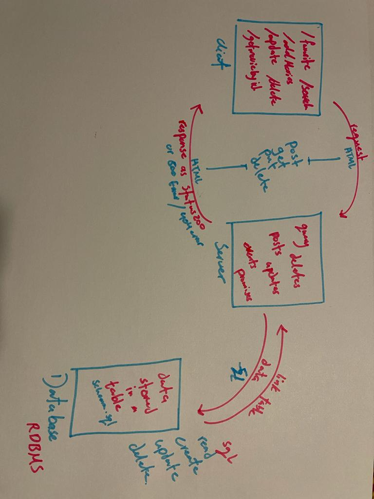

# movies-library - version : 00

**Author Name** : Diala Abul-Khail

## WRRC

## Overview

A Movie webpage that provides variety of trending movies.

## Project features
this webpage has many features like trending, addMovies and favorite pages which can make you save and get you your favorite and latest movies, it also has the search page to help you easily find what you're looking for.. there are also other pages that provides deleting and updating data and of coarse the features of getting items and adding items by the id number of the movie.

## Getting started
 first after initializing npm, we downloaded npm packages: dotenv, cors,axios,express and pg,,, after installing npm 

 2- we require all the packages in a server.js file 

 3- add a new file (.env), const the port in server.js then added to the env const PORT = process.env.PORT; we also do that to the database url, and the API key

4- create a new error handle (app.use(errorHandle)

5- create a new get of trending and search 

6- get the API keys. 

7- created a constructor for the trending function with the required info

8- made the trending function and used .then because its considered Promise and will take time, call the axois.get(url) and use .then/// here you map the data from the api and .catch/// in catch you call the new error function 

9- make the search function using &useSearch in api link after defining it in a constant and we do the same as trending function 

10-made the 500 error function and send err object 

11- we add listen function to make sure the port is working fine task 13 

12 - added two more endpoints one of them a post method to add movies (as a request) : in the function sql is defined with (INSERT INTO.. ) and values are defined as an array of the requested data, here we call the client.query and add (rows)to the json data in response 

13- for the get movie handler: sql is defined as (SELECT * FROM ..) and also we need to call client.query task 14 

14 - three more endpoint were created (update,delete,get) the same way as (get and add movies) but here delete is used to delete, put is used to update 

15- update and get are functions with id, created to make aa change on specific data 

16- status error for the delete handler is 204 which means there are no returnig data 

17 - we connet the client to the listening function at the end. task 15 

18- created a profile in heroku 

19- downloaded a postgres resource 

20- copied the API to the configures 21- linked it to the repository in github and then deployed it 22- got the url for the code/database

